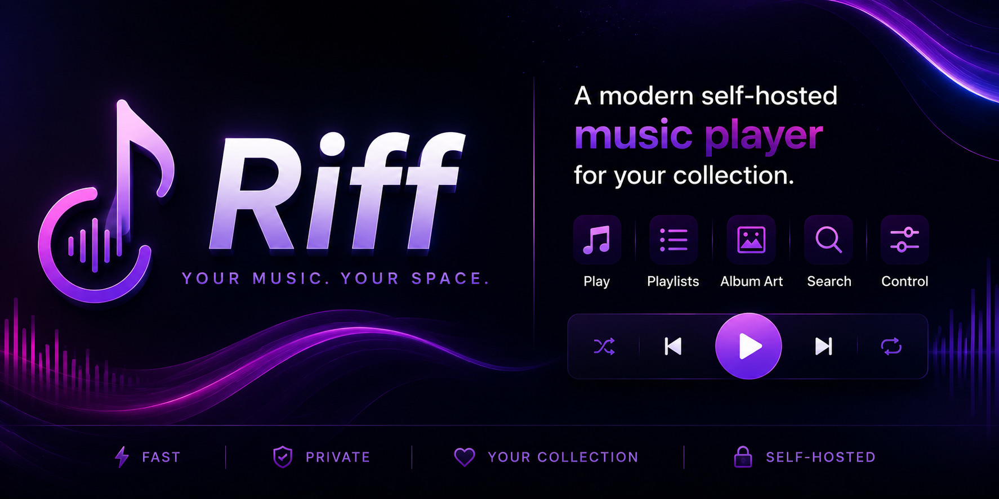
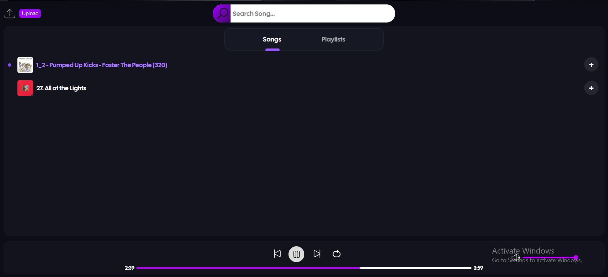
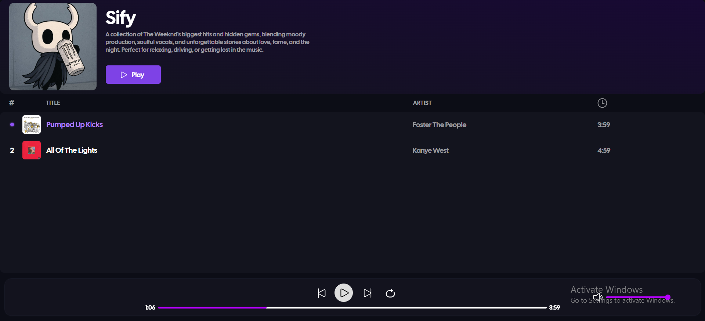

<p align="center">
  
</p>

<h1 align="center">🎵 Riff</h1>

<p align="center">
A modern self-hosted music player built with Flask.
<br>
Upload, organize, and stream your local music collection through a clean and responsive web interface.
</p>

<p align="center">
  
  
  
  
</p>

---

## ✨ Features

- 🎵 Upload MP3 files
- 📂 Create and manage playlists
- 🖼️ Automatic album artwork extraction
- 🔍 Real-time song search
- ▶️ Play, pause, previous, and next controls
- 🔁 Loop playback
- 🔊 Volume control
- ⚡ Lightweight SQLite database
- 📱 Responsive interface for desktop and mobile

---

## 🛠️ Built With

- Python
- Flask
- HTML5
- CSS3
- JavaScript
- SQLite
- Mutagen

---

## 📦 Installation

Clone the repository:

```bash
git clone https://github.com/YOUR_USERNAME/Riff.git
cd Riff
```

Install the dependencies:

```bash
pip install -r requirements.txt
```

Run the application:

```bash
python app.py
```

Open your browser:

```
http://127.0.0.1:5000
```

---

## 📸 Screenshots

### Home

> Add a screenshot here.



### Playlist

> Add a screenshot here.



---

## 📁 Project Structure

```
Riff/
├── static/
│   ├── assets/
│   ├── css/
│   ├── js/
│   ├── cover/
│   └── music/
├── templates/
├── screenshots/
├── app.py
├── requirements.txt
├── README.md
└── .gitignore
```

---

## 🚀 Roadmap

- ⭐ Favorites
- 🔀 Shuffle playback
- 🕒 Recently played
- 🎨 Theme customization
- 👤 User authentication
- 📜 Lyrics support
- 🎶 Queue management improvements

---

## 🤝 Contributing

Contributions, feature requests, and suggestions are welcome. Feel free to fork the repository and submit a pull request.

---

## 📄 License

This project is licensed under the MIT License.
